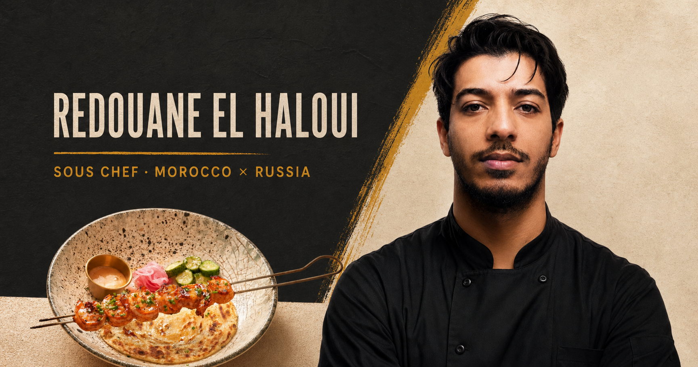

# Redouane El Haloui — Chef Portfolio



An interactive multilingual portfolio for **Redouane El Haloui**, a Moroccan
Sous Chef and professional culinary specialist currently based in Kazan,
Russia.

The site presents Redouane’s culinary story, selected dishes, restaurant
experience, professional skills, education, languages, and downloadable CVs.

## Live portfolio

[amyargotti.github.io/chefsito-portfolio](https://amyargotti.github.io/chefsito-portfolio/)

## Languages

The complete portfolio is available in:

- English
- Russian
- French

Visitors can switch languages from the site header. Dish descriptions,
professional experience, education, skills, contact information, and interface
labels are translated together.

## Portfolio highlights

- Responsive editorial design for desktop and mobile
- Filterable culinary gallery
- Full-screen dish photography
- Seven-restaurant professional timeline
- Professional skills and HACCP profile
- Dentistry education at Kazan State Medical University
- Direct email and telephone contact links
- Accessible keyboard interactions
- Custom social-sharing preview

## Downloadable CVs

Each CV uses a clean, one-page, ATS-friendly A4 format with searchable text.

- [English CV](public/cv/Redouane-El-Haloui-CV-English.pdf)
- [Russian CV](public/cv/Redouane-El-Haloui-CV-Russian.pdf)
- [French CV](public/cv/Redouane-El-Haloui-CV-Francais.pdf)

The PDFs can also be downloaded directly from the portfolio’s CV menu.

## Contact

**Redouane El Haloui**<br>
Sous Chef · Professional Chef · Fifth-year Dentistry Student

- Email: [redoineelhaloui@yahoo.com](mailto:redoineelhaloui@yahoo.com)
- Telephone: [+7 986 925 41 99](tel:+79869254199)
- From: Rabat, Morocco
- Currently based in: Kazan, Russia

## Technology

- Next.js and React
- TypeScript
- Tailwind CSS
- vinext and Cloudflare-compatible output
- ReportLab CV generation

## Run locally

Requirements: Node.js 22.13 or newer.

```bash
npm install
npm run dev
```

Open the local URL shown in the terminal.

## Validate the production build

```bash
npm run build
```

## Regenerate the CVs

The CV source is maintained in `scripts/generate_cvs.py`.

```bash
python3 scripts/generate_cvs.py
```

Generated website copies are saved under `public/cv/`.

## Repository

[github.com/AmyArgotti/chefsito-portfolio](https://github.com/AmyArgotti/chefsito-portfolio)
